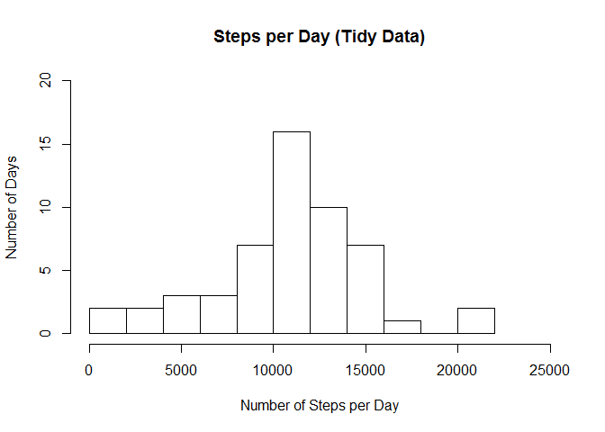
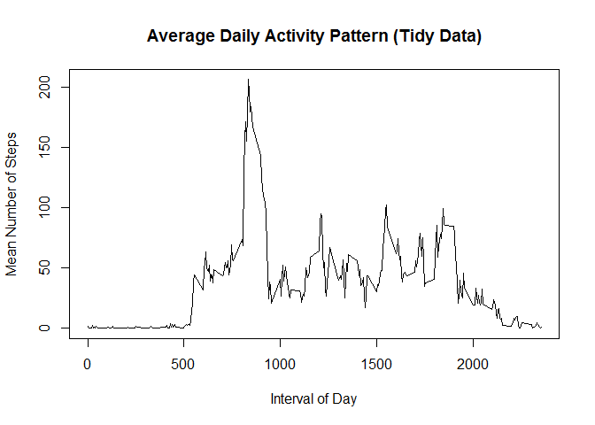
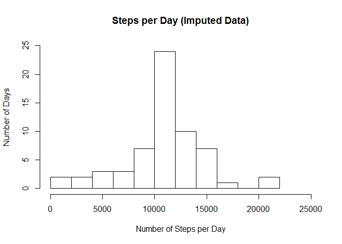
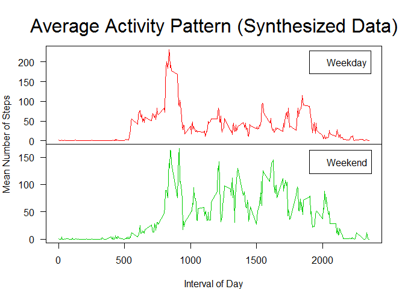

# PA1_template.Rmd
Jeffrey Norton  
February 21, 2017  


```r
# Operate in current directory
setwd(getSrcDirectory(function(x) {x}))
```

# Introduction

"It is now possible to collect a large amount of data about personal movement using activity monitoring devices such as a [Fitbit](http://www.fitbit.com/), [Nike Fuelband](http://www.nike.com/us/en_us/c/nikeplus-fuelband), or [Jawbone Up](https://jawbone.com/up). These type of devices are part of the "quantified self" movement - a group of enthusiasts who take measurements about themselves regularly to improve their health, to find patterns in their behavior, or because they are tech geeks. But these data remain under-utilized both because the raw data are hard to obtain and there is a lack of statistical methods and software for processing and interpreting the data.

"This assignment makes use of data from a personal activity monitoring device. This device collects data at 5 minute intervals through out the day. The data consists of two months of data from an anonymous individual collected during the months of October and November, 2012 and include the number of steps taken in 5 minute intervals each day."

-- Quoted from [Assignment](https://www.coursera.org/learn/reproducible-research/peer/gYyPt/course-project-1)

## Step 1: Collect and Read the data


```r
activity.data.raw <- read.csv(file="activity.csv", header=TRUE, sep=",")
print(paste0("Number Rows (raw data)=", nrow(activity.data.raw)))
```

```
## [1] "Number Rows (raw data)=17568"
```

```r
print(head(activity.data.raw))
```

```
##   steps       date interval
## 1    NA 2012-10-01        0
## 2    NA 2012-10-01        5
## 3    NA 2012-10-01       10
## 4    NA 2012-10-01       15
## 5    NA 2012-10-01       20
## 6    NA 2012-10-01       25
```

## Step 2: Tidy up the Raw Data

The original data has many incomplete cases, i.e., those with NA values.  Reduce the set down to those with complete data.

```r
activity.data.tidy <- activity.data.raw[complete.cases(activity.data.raw),]
print(paste0("Number Rows (tidy data)=", nrow(activity.data.tidy)))
```

```
## [1] "Number Rows (tidy data)=15264"
```

```r
print(head(activity.data.tidy))
```

```
##     steps       date interval
## 289     0 2012-10-02        0
## 290     0 2012-10-02        5
## 291     0 2012-10-02       10
## 292     0 2012-10-02       15
## 293     0 2012-10-02       20
## 294     0 2012-10-02       25
```

## Step 3: Question 1 - What is mean total number of steps taken per day?

Ignore the incomplete data - use the tidy set.  

First get the unique days.  Then, count the number of step taken each day.

```r
unique.days <- unique(activity.data.tidy[,2])
steps.per.day <- integer(length=length(unique.days))
i <- 1
for( day in unique.days ) {
  day.values <- activity.data.tidy[activity.data.tidy$date==day,]
  steps.per.day[i] <- sum(day.values[,1])
  i <- i+1
}
```
Create a histogram of the number of steps per day.

```r
hist(steps.per.day, main="Steps per Day (Tidy Data)", xlab="Number of Steps per Day", ylab="Number of Days", breaks=12,
     xlim=c(0,25000), ylim=c(0,20))
```

<!-- -->
Mean and median of steps per day:

```r
print(paste0("Mean (Steps per day): ", mean(steps.per.day)))
```

```
## [1] "Mean (Steps per day): 10766.1886792453"
```

```r
print(paste0("Median (Steps per day): ", median(steps.per.day)))
```

```
## [1] "Median (Steps per day): 10765"
```

## Step 4: Question 2 - What is the average daily activity pattern?

Extract the intervals and calculate the mean of the daily number of steps in each of those intervals.

```r
unique.intervals <- unique(activity.data.tidy[,3])
mean.steps.per.interval <- integer(length=length(unique.intervals))
i <- 1
for( interval in unique.intervals ) {
  interval.values <- activity.data.tidy[activity.data.tidy$interval==interval,]
  mean.steps.per.interval[i] <- mean(interval.values[,1])
  i <- i+1
}
df <- data.frame(intervals=unique.intervals, mean_steps=mean.steps.per.interval)
plot(x=df$intervals, y=df$mean_steps, type="l", main="Average Daily Activity Pattern (Tidy Data)", xlab="Interval of Day",
     ylab="Mean Number of Steps")
```

<!-- -->

## Step 5: Question 3 - Imputing Missing Values


```r
number.NAs <- nrow(activity.data.raw) - nrow(activity.data.tidy)
```

There are 17568 total rows in the original data.  There are 2304 missing values (rows with NAs) in the original data set.  A reasonable strategy for imputing the 
values for the missing steps is to use the mean number of steps for the interval whose value is missing.  That
value can be found from the data frame *df*.  Using that strategy, synthesize a complete data set.

```r
activity.synthesized.data <- activity.data.raw
for( i in 1:nrow(activity.synthesized.data) ) {
  if( is.na(activity.synthesized.data[i,]$steps) ) {
    activity.synthesized.data[i,]$steps <- df[df$intervals==activity.synthesized.data[i,]$interval,]$mean_steps
  }
}
# Double check that there are no NAs left
print(summary(complete.cases(activity.synthesized.data)))
```

```
##    Mode    TRUE    NA's 
## logical   17568       0
```
Now, recreate the histogram of the data and report the mean and median values on the synthesized data with imputed values.  

```r
unique.days.imputed <- unique(activity.synthesized.data[,2])
steps.per.day.imputed <- integer(length=length(unique.days.imputed))
i <- 1
for( day in unique.days.imputed ) {
  day.values.imputed <- activity.synthesized.data[activity.synthesized.data$date==day,]
  steps.per.day.imputed[i] <- sum(day.values.imputed[,1])
  i <- i+1
}
hist(steps.per.day.imputed, main="Steps per Day (Imputed Data)", xlab="Number of Steps per Day", ylab="Number of Days", breaks=12,
     xlim=c(0,25000), ylim=c(0,25))
```

<!-- -->

The mean and mean number of (imputed) steps per day:

```r
print(mean(steps.per.day.imputed))
```

```
## [1] 10766.19
```

```r
print(median(steps.per.day.imputed))
```

```
## [1] 10766.19
```
To better see the effect of imputing the data, use a data frame

```r
effect.df <- data.frame(mean=c(mean(steps.per.day),mean(steps.per.day.imputed)),
                        median=c(median(steps.per.day),median(steps.per.day.imputed)))
row.names(effect.df) <- c("Tidy", "Imputed")
print(effect.df)
```

```
##             mean   median
## Tidy    10766.19 10765.00
## Imputed 10766.19 10766.19
```
The fact that the mean values are equivalent should be expected since we are assigning the missing values as the mean
values.  We note that the difference in the mean and median values of the tidy set is small, so it is not surprising
that the difference in the median values between the tidy and synthesized (imputed) data is also very small.  It is also
interesting that the median vale for the synthesized set is the same as the mean value - likely the effect of assigning
so many mean values back into the synthesized set.

# Step 6: Question 4 - Are there differences in activity patterns between weekdays and weekends?

Add a factor variable (as a column) to the synthesized dataset to distinguish between weekdays and weekends.

```r
days.of.week <- weekdays(as.Date(activity.synthesized.data$date))
day.factor <- lapply(days.of.week, function(x) if(x=="Saturday" || x=="Sunday") "weekend" else "weekday")
day.factor <- as.factor(unlist(day.factor))
cnames <- colnames(activity.synthesized.data)
sap.activity.data <- cbind(activity.synthesized.data, day.factor)
colnames(sap.activity.data) <- c(cnames, "weekday_or_weekend")
print(head(sap.activity.data))
```

```
##       steps       date interval weekday_or_weekend
## 1 1.7169811 2012-10-01        0            weekday
## 2 0.3396226 2012-10-01        5            weekday
## 3 0.1320755 2012-10-01       10            weekday
## 4 0.1509434 2012-10-01       15            weekday
## 5 0.0754717 2012-10-01       20            weekday
## 6 2.0943396 2012-10-01       25            weekday
```

Create a panel plot (time series) for weekday and weekend values.


```r
wk.end <- sap.activity.data[sap.activity.data$weekday_or_weekend=="weekend",]
wk.day <- sap.activity.data[sap.activity.data$weekday_or_weekend=="weekday",]
unique.intervals <- unique(wk.end[,3])
mean.steps.per.interval <- integer(length=length(unique.intervals))
i <- 1
for( interval in unique.intervals ) {
  interval.values <- wk.end[wk.end$interval==interval,]
  mean.steps.per.interval[i] <- mean(interval.values[,1])
  i <- i+1
}
wk.end.df <- data.frame(intervals=unique.intervals, mean_steps=mean.steps.per.interval)
unique.intervals <- unique(wk.day[,3])
mean.steps.per.interval <- integer(length=length(unique.intervals))
i <- 1
for( interval in unique.intervals ) {
  interval.values <- wk.day[wk.day$interval==interval,]
  mean.steps.per.interval[i] <- mean(interval.values[,1])
  i <- i+1
}
wk.day.df <- data.frame(intervals=unique.intervals, mean_steps=mean.steps.per.interval)
layout(matrix(1:2,ncol=1),widths=1,heights=c(2,2),respect=FALSE)
par(mar = rep(0, 4), oma=c(4, 4, 4, 2), las=1)
plot(x=wk.day.df$intervals, y=wk.day.df$mean_steps, type="l", ann=FALSE, xaxt='n', col=2)
legend(1900,170,legend=c("Weekday"), yjust=0)
#     main="Average Weekday Activity Pattern (Synthesized Data)", xlab="Interval of Day",
#     ylab="Mean Number of Steps")
plot(x=wk.end.df$intervals, y=wk.end.df$mean_steps, type="l", ann=FALSE, col=3)
legend(1900,120,legend=c("Weekend"), yjust=0)
#     main="Average Weekend Activity Pattern (Synthesized Data)", xlab="Interval of Day",
#     ylab="Mean Number of Steps")
#title("Average Activity Pattern (Synthesized Data)", outer=TRUE)
mtext("Interval of Day", side=1, line=3, outer=TRUE)
mtext("Mean Number of Steps", side=2, line=3, outer=TRUE, las=0)
mtext("Average Activity Pattern (Synthesized Data)", side=3, line=1, outer=TRUE, cex=2, font=1)
```

<!-- -->
